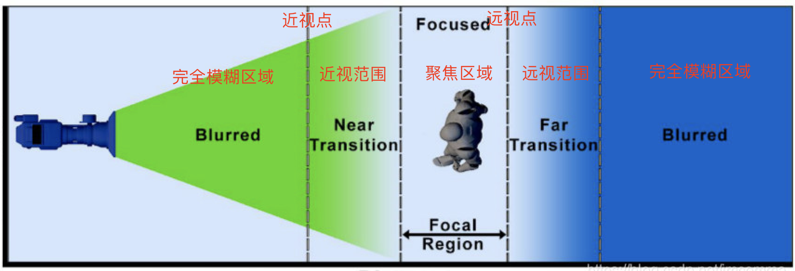

# 实例方法
## 高级
### `addCustomStage(customStageInstance)`
在地图中添加自定义图层。详见[自定义图层](/api-reference/custom-stage.html)

### `getParticleEmitter(options)`
获取一个例子发射器。

**参数列表：**

*options\<object>* 所有配置项都是可选的
|  名称   | 描述  |
|  ----  | ----  |
| **coord\<Array\<number>>** default: [0, 0]| 粒子坐标，经纬度。 |
| **altitude\<string>** default: 0 | 粒子整体海拔。 |
| **texture\<HTMLImageElement>** default: null | 单个粒子的贴图。 |
| **particlesPerSecond\<number>** default: 100 | 每秒发射的粒子数。 |
| **positionRange\<object>** | 生成粒子的发射初始位置范围，具体配置见下表。 |
| **directionRange\<object>** | 粒子的发射方向范围，具体配置见下表。 |
| **speedRange\<Array\<number>>** default: [8, 8] | 粒子发射速度的随机生成范围。 |
| **sizeRange\<Array\<number>>** default: [100, 100] | 粒子大小的随机生成范围。 |
| **sizeTween\<Tween>** default: null | 粒子大小Tween函数。设置改项后`sizeRange`无效。如：`[[0, 10], [20, 80]`的意思是0秒时粒子的大小为20，10秒时粒子的颜色为80，并对2~9秒时的粒子大小进行线性插值。 |
| **color\<string>** default: `"#fff"` | 粒子的基础颜色。 |
| **colorRangeRadius\<number>** default: 0 | 用于生产粒子随机颜色的半径变量，若为0，则表示颜色固定，不随机。 |
| **colorTween\<Tween>** default: null | 粒子颜色Tween函数。设置改项后`color`、`colorRangeRadius`无效。如：`[[0, 10], ["#fff", "#f00"]`的意思是0秒时粒子的颜色为`#fff`，10秒时粒子的颜色为`#f00`，并对2~9秒时的粒子颜色进行线性插值。 |
| **opacityRange\<Array\<number>>** default: [1, 1] | 粒子透明度的随机生成范围。 |
| **opacityTween\<Tween>** default: null | 粒子透明度Tween函数。设置改项后`opacityRange`无效。如：`[[0, 10], [1, 0]]`的意思是0秒时粒子的透明度为1，10秒时粒子的透明度为0，并对2~9秒时间的粒子透明度进行线性插值。 |
| **premultipliedAlpha\<boolean>** default: `true` | 是否要开启alpha预乘。开启后，低透明度的颜色会偏黑，但是透明叠加会更加自然。 |
| **depthTest\<boolean>** default: true | 是否开启深度测试 |


**参数详情：**
*positionRange\<object>* 粒子的发射初始位置生成范围
|  名称   | 描述  |
|  ----  | ----  |
| **center\<Array\<number>>** default: [0, 0, 0]| 粒子的发射中心，一个相对坐标，相对于coord进行偏移。 |
| **radius\<number>** default: 0 | 用于生成粒子随机发射初始位置的半径变量。 |
| **phiLimit\<<Array\<number>>** default: [Math.PI / 2, Math.PI / 2] | 用于生成粒子随机发射初始位置的绕X轴角度范围。 |
| **thetaLimit\<<Array\<number>>** default: [0, Math.PI * 2] | 用于生成粒子随机发射初始位置的绕Y轴角度范围。 |

*directionRange\<object>* 粒子的发射方向范围
|  名称   | 描述  |
|  ----  | ----  |
| **phiLimit\<<Array\<number>>** default: [-Math.PI / 8, Math.PI / 8] | 用于生成粒子随机发射方向的绕X轴角度范围。 |
| **thetaLimit\<<Array\<number>>** default: [0, Math.PI * 2] | 用于生成粒子随机发射方向的绕Y轴角度范围。 |

**返回值：**

[Emitter内部类实例](/api-reference/inner-class.html#emitter)

**示例：**
```js
const emitter = map.getParticleEmitter({
  coord: [120.17056998973987, 30.24025318112949],
  altitude: 0,
  texture: textures[6],
  particlesPerSecond: 100,
  particleDeathAge: 10,
  positionRange: {
      center: [0, 0, 0],
      radius: 0,
      phiLimit: [Math.PI / 2, Math.PI / 2],
      thetaLimit: [0, Math.PI * 2],
  },
  directionRange: {
      phiLimit: [-Math.PI / 8, Math.PI / 8],
      thetaLimit: [0, Math.PI * 2],
  },
  speedRange: [8, 8],
  sizeRange: [100, 100],
  color: "#ccc",
  colorRangeRadius: 0.2,
  opacityTween: [
      [0, 3],
      [1, 0],
  ],
  blendMode: "AdditiveBlending",
  depthTest: true,
});
```

### `removeEmitter(emitter)`
移除一个例子发射器。

**参数列表：**

*emitter\<Emitter>* 要移除的Emitter的对象

**示例：**
```js
map.removeEmitter(emitter)
```

### `addBuildings(options)`
在地图中添加3D建筑。

**参数列表：**

*options\<object>* 所有配置项都是可选的
|  名称   | 描述  |
|  ----  | ----  |
| **layerId\<string>** | 图层id |
| **textures\<Array\<HTMLImageElement>>** | 建筑贴图，必须为6张或者0张 |
| **roofcolor\<string>** default: 'auto' | 屋顶色，若未设置`textures`则忽略此项。 |
| **minzoom\<number>** default: 10 | 在此缩放层级开始显示建筑图层。 |
| **maxzoom\<number>** default: 20 | 建筑图层最大可以显示到此缩放层级。 |
| **buildingColor\<\<string>\|\|Array\<string>>** default: '#fff' | 建筑颜色。若为数组，则为渐变色，第一个元素为底部颜色，第二个元素为顶部颜色。若设置`textures`则改颜色和贴图进行混合，混合参数为`mixinStrength`。 |
| **opacity\<string>** default: 1 | 建筑透明度 |
| **sourceLayer\<string>** default: 'buildings' | 矢量瓦片内部图层。 |
| **source\<string>** default: 'composite' | 矢量瓦片源 |
| **heightField\<string>** default: 'height' | 源数据中用于生成建筑高度的字段。 |
| **before\<string>** default: null | 将建筑图层添加到那个图层之前，默认添加在图层列表末尾。 |
| **mixinStrength\<number>** default: 1 | 混合建筑贴图和建筑颜色的参数。 |
| **vignetting\<number>** default: false | 是否开启边缘暗角特效 |
| **light\<object>** default: {enable: false, color: '#000', strength: 1.0} | 建筑打光配置，注：颜色采用加法算法。 |


**示例：**
```js
map.addBuildings({
  buildingColor: '#fff',
  activeZoom: 12,
  removeZoom: 7,
  opacity: 0.2
});
```

### `removeBuilding()`
在地图中移除3D建筑。

**示例：**
```js
map.removeBuilding();
```

### `addCover(options)`
在地图中添加防护罩。

**参数列表：**

*options\<object>* 所有配置项都是可选的
|  名称   | 描述  |
|  ----  | ----  |
| **bounds\<[LngLatBounds](/api-reference/common-class.html#lnglatbounds)>** | 防护罩中心点 |
| **coverColor\<string>** default: '#2959F0' | 防护罩色。 |
| **coverOpacity\<number>** default: 1 | 防护罩透明度 |
| **scanColor\<string>** default: '#3F95FF' | 冲击波颜色 |
| **scanOpacity\<number>** default: 1| 冲击波透明度 |
| **scanWidthFactor\<number>** default: 0.06 | 冲击波宽度系数 |
| **speed\<number>** default: 0.01 | 冲击波速度系数 |

**返回值：**

Cover内部类实例


**示例：**
```js
map.addCover({
  bounds
});
```

### `removeCover(cover)`
在地图中移除防护罩。

**参数列表：**

*cover\<Cover>* 要移除的Cover的对象


**示例：**
```js
map.removeCover(cover);
```

### `addMeshLine(geojson, options)`
在地图中添加带宽度、带高度、带海拔的线条。

**参数列表：**

*geojson\<geojson>* 需要添加的地理线条，其类型必须为`MultiLineString`，格式如下：
```json
{
  "type": "FeatureCollection",
  "name": "xxxx",
  "crs": {
    "type": "name",
    "properties": { },
  },
  "features": [
    {
      "type": "Feature",
      "properties": { },
      "geometry": {
          "type": "MultiLineString",
          "coordinates": [
            [
              [119.857096, 30.259975],
              [119.853097, 30.259962]
            ],
            [
              [119.857365, 30.259774],
              [119.857187, 30.259771]
            ]
          ]
      }
    }
  ]
}
```

*options\<object>* 所有配置项都是可选的
|  名称   | 描述  |
|  ----  | ----  |
| **lineWidth\<string>** | 线宽 |
| **color\<color>** default: '#fff' | 线条颜色 |
| **opacity\<number>** default: 1 | 线条透明度 |
| **height\<number>** default: 0 | 线条高度，单位：米 |
| **altitude\<number>** default: 0| 线条海拔，单位：米 |

**返回值：**

MeshLine内部类实例


**示例：**
```js
map.addMeshLine(line, {
  color: 'red',
  opacity: 0.5,
  height: 100,
  altitude: 1000
});
```

### `removeMeshLine(meshLine)`
在地图中移除MeshLine。

**参数列表：**

*meshLine\<MeshLine>* 要移除的MeshLine的对象


**示例：**
```js
map.removeCover(meshLine);
```

### `addSkyBox(options)`
添加天空盒。

::: tip
注意：由于`WebGL`相关限制，天空盒贴图的大小必须为2的n次幂，比如：1024×1024、4096×4096。
:::

**参数列表：**

*options\<object>*
|  名称   | 描述  |
|  ----  | ----  |
| **textures\<Array\<HTMLImageElement>>** | 贴图数组，一共需要添加6张贴图，分别对应右、左、上、下、前、后 |


**示例：**
```js
map.addCover({
  textures: [right, left, top, bottom, front, back]
});
```

### `addMarker(options)`
地图打点。

**参数列表：**

*options\<object>* 除`id`外，所有参数都是可选的。
|  名称   | 描述  |
|  ----  | ----  |
| **id\<string>** | 打点id |
| **header\<{show: boolean, fragment: string, style: Object, scale: Stops}>** | 打点头部的配置，`show`为是否显示 ，`fragment`为`HTML`片段，`style`为`css`样式, `scale`为Stops数组 |
| **body\<{show: boolean, width: number, color: string, depthTest: boolean}>** | 打点中部的配置，`show`为是否显示 ；`width`为中部宽度；`color`为中部整体颜色；`depthTest`为是否启用深度测试，默认为`false`|
| **base\<{show: boolean, image: HTMLImageElement, size: Array\<number>, depthTest: boolean}>** | 打点底部的配置，`show`为是否显示 ；`image`为图片对象；`size`为图片大小 ； `depthTest`为是否启用深度测试，默认为`false`|
| **coord\<Array\<number>>** | 打点经纬度 |
| **altitude\<number>** | 打点海拔高度 |
| **height\<number>** | 打点整体高度 |
| **onclick\<Function>** | 点击事件回调函数 |
| **minzoom\<number>** | 最小显示层级 |
| **maxzoom\<number>** | 最大显示层级 |
| **zIndex\<number>** | marker.header.style的z-index值 |

**默认值：**
```js
{
  id: "",
  header: {
      fragment: null,
      scale: [
          [16, 1.5],
          [15, 1],
          [10, 0.3],
          [5, 0],
      ],
      style: {}
  },
  body: {
      show: true,
      color: "#FFF",
      width: 1,
  },
  base: {
      image: null,
      size: [10, 10],
  },
  coord: [0, 0],
  altitude: 0,
  onclick: () => {},
}
```

**返回值：**

[Marker内部类实例](/api-reference/inner-class.html#marker)


**示例：**
```js
map.addMarker({
    id: "markerTest",
    header: {
        fragment: `
            <p>这是1号打点</p>
            
        `,
        style: {
            color: "#fff",
            display: "flex",
            "flex-direction": "column",
            "align-items": "center",
        },
    },
    body: {
        color: "#FFB557",
    },
    base: {
        image: texture,
    },
    coord: [120.20853164716578, 30.25113591444385],
    altitude: 400,
    onclick: (e) => {
        console.log(e);
    },
});
```

### `removeMarker(marker)`
在地图上移除打点。

**参数列表：**

*marker\<Marker>* Marker对象。

**返回值：**

一个Promise对象，fulfilled后移除打点。

**示例：**
```js
await map.removeMarker(marker);
```

### `addPopup(options)`
地图添加popup浮窗。

**参数列表：**

*options\<object>* 所有参数都是可选的。
|  名称   | 描述  |
|  ----  | ----  |
| **content\<string>** | 浮窗内容 |
| **style\<object>** | 样式配置，css样式|
| **scale\<Stops>** | 缩放配置 |
| **coord\<Array\<number>>** | 浮窗经纬度 |
| **altitude\<number>** | 浮窗整体高度 |
| **onclick\<Function>** | 点击事件 |

**返回值：**

Popup内部类实例

**示例：**
```js
map.addPopup({
  coord: [lnglat.lng, lnglat.lat],
  altitude: 600,
  content: 'asdasdasds',
  style: {
    width: '100px',
    height: '100px',
    background: '#fff'
  },
  onclick:() => { console.log(1111); },
})
```

### `removePopup(popup)`
地图移除popup浮窗。

**参数列表：**

*popup\<Popup>* 浮窗对象popup。

**示例：**
```js
map.removePopup(popup)
```

### `lightUpBuilding(options)`
点亮建筑。

**参数列表：**

*options\<object>* 所有配置项都是可选的
|  名称   | 描述  |
|  ----  | ----  |
| **coord\<Array\<number>>** default: [0, 0] | 建筑所处的经纬度 |
| **raduis\<number>** default: 0.000006 | 点亮半径 |
| **color\<string>** default: 'yellow' | 点亮颜色 |

**返回值：**

Emitter内部类实例

**示例：**
```js
map.lightUpBuilding({
    coord: [lng, lat],
    color: 'yellow'
});
```

### `setFlotsam(options)`
设置漂浮物。

**参数列表：**

*options\<object>* 除`texture`外，所有配置项都是可选的
|  名称   | 描述  |
|  ----  | ----  |
| **coord\<Array\<number>>** default: [0, 0] | 漂浮物区域中心经纬度 |
| **texture\<HTMLImageElement>** | 漂浮物贴图 |
| **altitude\<number>** default: 5000 | 漂浮物开始发射的高度，单位 米 |
| **raduis\<number>** default: 0.0002 | 漂浮物开始发射的半径 |
| **deathAge\<number>** default: 10 | 漂浮物从开始到消失的时间 |
| **perSecond\<number>** default: 200 | 每秒钟发射漂浮物的个数 |
| **sizeRange\<Array\<number>>** default: [10, 30] | 漂浮物的大小范围 |
| **speedRange\<Array\<number>>** default: [1, 1] | 漂浮物下落的速度范围 |

**返回值：**

Emitter内部类实例

**示例：**
```js
map.setFlotsam({
    coord: [120.20853164716578, 30.25113591444385],
    texture: snow,
    altitude: 3000,
    raduis: 0.0002,
    deathAge: 10,
    perSecond: 200,
    sizeRange: [10, 50]
})
```

### `focus(options, callback)`
让地图聚焦某处。

**参数列表：**

*options\<object>* 所有配置项都是可选的
|  名称   | 描述  |
|  ----  | ----  |
| **center\<Array\<number>>** default: [0, 0] | 聚焦中心经纬度 |
| **zoom\<number>** default: 18 | 聚焦时地图的缩放值 |
| **pitch\<number>** default: 47 | 聚焦时地图的俯仰角 |
| **rotation\<boolean>** default: true | 聚焦时相机是否要旋转 |
| **lightOptions\<{enable: boolean, height: number, duration: number}>** default: {enable: true, duration: 300, height: 60} | 聚焦时的聚光灯效果设置 |

*callback\<Function>* 聚焦动画结束后的回调函数

**示例：**
```js
 map.focus(
  {
      center: [lng, lat],
      zoom: 15.5,
      pitch: 47,
      lightOptions: {
          enable: true,
          height: 70,
      },
  },
  () => {console.log('聚焦结束')}
);
```

### `addFlyLine(options)`
在地图中添加飞线

**参数列表：**

*options\<object>* 所有配置项都是可选的
|  名称   | 描述  |
|  ----  | ----  |
| **src\<Array\<number>>** default: [0, 0] | 飞线起点经纬度 |
| **dest\<Array\<number>>** default: [0, 0] | 飞线终点经纬度 |
| **lineColor\<string>** default: '#FB5431' | 飞线颜色 |
| **backgroundColor\<string>** default: '#FB5431' | 飞线背景线颜色 |
| **backgroundOpacity\<number>** default: 0.5 | 飞线背景线透明度 |
| **size\<number>** default: 5 | 飞线大小 |
| **points\<number>** default: 1000 | 飞线细分数 |
| **altitude\<number>** default: 400000 | 飞线高度，单位 米 |

**返回值：**

FlyLine内部类实例

**示例：**
```js
 map.addFlyLine({
    src: [-79.493023, 36.471726],
    dest: [120.20853164716578, 30.25113591444385],
    lineColor: "#FB5431",
    backgroundColor: "#FB5431",
    backgroundOpacity: 0.5,
    size: 5,
    altitude: 6000000,
    points: 10000,
});
```

### `removeFlyLine(flyLine)`
在地图中移除飞线

**参数列表：**

*flyLine\<FlyLine>* 飞线对象

**示例：**
```js
 map.removeFlyLine(flyLine);
```

### `setDOF(options)`
在地图中设置景深。

**参数列表：**

*options\<object>* 所有配置项都是可选的
|  名称   | 描述  |
|  ----  | ----  |
| **enable\<boolean>** default: false | 是否开启 |
| **blurRadius\<number>** default: 7 | 模糊半径 |
| **near\<number>** default: 0.45 | 近视点 |
| **nearRange\<number>** default: 0.15 | 近视范围 |
| **far\<number>** default: 0.6 | 远视点 |
| **farRange\<number>** default: 0.1 | 远视范围 |

关于参数的解释：

从相机位置，到离相机最远的点，距离为1。也就是说，完全模糊区域（近） + 近视范围 + 聚焦区域 + 远视范围 + 完全模糊区域（远） = 1

各个参数的示意图如下：



**示例：**
```js
 map.setDOF({
    enable: true,
    blurRadius: 8,
    near: 0.42,
    nearRange: 0.17,
    far: 0.59,
    farRange: 0.1,
});
```

### `addStreamer(geojson, options)`
在地图中添加地面流光。

**参数列表：**

*geojson\<geojson>* 需要添加流光的地理线条，其类型必须为`MultiLineString`，格式如下：
```json
{
  "type": "FeatureCollection",
  "name": "xxxx",
  "crs": {
    "type": "name",
    "properties": { },
  },
  "features": [
    {
      "type": "Feature",
      "properties": { },
      "geometry": {
          "type": "MultiLineString",
          "coordinates": [
            [
              [119.857096, 30.259975, 1000],
              [119.853097, 30.259962, 1000]
            ],
            [
              [119.857365, 30.259774, 1000],
              [119.857187, 30.259771, 1000]
            ]
          ]
      }
    }
  ]
}
```

*options\<object>* 所有配置项都是可选的
|  名称   | 描述  |
|  ----  | ----  |
| **lineWidth\<number>** default: 1 | 流光线条宽度 |
| **length\<number>** default: 0.3 | 流光线段占总线长百分比 |
| **minLength\<number>** default: 0 | 该线条长度以下的线条不展示流光效果，单位：米 |
| **lineColor\<color>** default: "#fff" | 流光线条颜色 |
| **blurRadius\<number>** default: 10 | 流光发光半径 |
| **blurStrength\<number>** default: 3 | 流光发光强度 |
| **speed\<number>** default: 1 | 流光流动的速度 |

**返回值：**

[Streamer内部类实例](/api-reference/inner-class.html#streamer)

**示例：**
```js
map.addStreamerLayer(geojson, {
  lineColor: '#FFF',
  blurRadius: 10,
  blurStrength: 2,
  length: 0.5,
  minLength: 500,
});
```

### `removeStreamer(streamer)`
在地图中移除地面流光。

**参数列表：**

*streamer\<Streamer>* 流光特效对象streamer。

**示例：**
```js
map.removeStreamer(streamer);
```

### `add3DModel(obj, options)`
在地图中添加3D模型。

**参数列表：**

*obj\<obj>* 通过`loadObj`公共方法导入模型后，返回的obj对象

*options\<object>* 所有配置项都是可选的
|  名称   | 描述  |
|  ----  | ----  |
| **texture\<HTMLImageElement>** default: null | 模型的贴图 |
| **color\<string>** default: "#fff" | 模型的颜色，当配置`texture`属性后，该属性无效 |
| **rotation\<Array\<{axis: string, angle: number}>>** default: [] | 模型旋转信息数组, `axis`为需要绕哪个坐标轴旋转，可选值:`"x"`, `"y"`, `"z"`；`angle`为需要旋转的角度 |
| **scale\<number>** default: 1 | 模型缩放数值 |
| **coord\<Array\<number>>** default: [0, 0] | 模型所在经纬度 |
| **altitude\<number>** default: 0 | 模型所在海拔高度 |
| **onClick\<Function>** default: (delta, obj) => {} | 模型点击事件 |
| **animate\<Function>** default: (delta, obj) => {} | 每帧渲染时会执行的函数，传递参数：帧间隔时间，单位ms；3D模型对象 |

**返回值：**

[Model内部类实例](/api-reference/inner-class.html#model)

**示例：**
```js
const car = await arkmap.loadObj("car.obj");
const model = map.add3DModel(
  {
    color: "#fff",
    rotation: [
      {
        axis: "x",
        angle: Math.PI / 2,
      },
      {
        axis: "y",
        angle: Math.PI / 2,
      },
    ],
    scale: 0.000001,
  }
);
```

### `remove3DModel(model)`
在地图中移除3D模型。

**参数列表：**

*model\<Model>* 模型对象model


**示例：**
```js
map.remove3DModel(model);
```

### `pathMoving(object, options)`
在地图中添加3D模型或者marker的路径动画。

**参数列表：**

*object\<Model | Marker>* 3D模型对象，**注意：此模型的头部必须朝向正北！**或者Marker对象

*options\<object>* 所有配置项都是可选的
|  名称   | 描述  |
|  ----  | ----  |
| **path\<Array\<number>>** default: [] | 路径对象，由[Navigation](/api-reference/common-class.html#navigation)对象产生 |
| **speed\<number>** default: 140 | 模型移动速度，单位：km/h |
| **duration\<number>** default: undefined | 动画持续时间，单位：ms，配置此项后`speed`参数失效 |
| **onRender\<function>** default: () => {} | 每一帧会触发的回调函数 |
| **onEnd\<function>** default: () => {} | 每次轨迹动画结束后会触发的回调函数 |
| **loop\<boolean>** default: true | 每次轨迹动画结束后是否会从头开始播放 |

**返回值：**

[PathMoving内部类实例](/api-reference/inner-class.html#pathmoving)

**示例：**
```js
const car = await arkmap.loadObj("car.obj");
const model = map.add3DModel(
  {
    color: "#fff",
    rotation: [
      {
        axis: "x",
        angle: Math.PI / 2,
      },
      {
        axis: "y",
        angle: Math.PI / 2,
      },
    ],
    scale: 0.000001,
  }
);
const navigation = new arkmap.Navigation(network)
const { path } = await navigation.findWayFuzzy(start, end);
const pm = map.pathMoving(model, {
  path,
  speed: 140,
});
pm.changeStatus(true);
```

### `removePathMoving(pathMoving)`
在地图中移除路径动画。

**参数列表：**

*pathMoving\<PathMoving>* 路径动画对象pathMoving


**示例：**
```js
map.removePathMoving(pathMoving);
```

### `addWall(obj, options)`
在地图中添加光墙。

**参数列表：**

*options\<object>* 所有配置项都是可选的
|  名称   | 描述  |
|  ----  | ----  |
| **path\<Array\<number>>** default: [] | 墙体的路径 |
| **color\<string>** default: "#fff" | 墙体的颜色 |
| **opacity\<number>** default: 1 | 墙体的透明度 |
| **height\<number>** default: 100 | 墙体的高度，单位：米 |
| **flowTexture\<HTMLImageElement>** default: null | 墙体的浮动纹理贴图 |
| **flowSpeed\<number>** default: 1 | 墙体的浮动纹理的浮动速度 |
| **altitude\<number>** default: 0 | 墙体的整体海拔高度，单位：米 |

**返回值：**

Wall内部类实例

**示例：**
```js
const wall = map.addWall({
  path: [
      [120.18964919661755, 30.199703307742638],
      [120.19642321440693, 30.202811279073572],
      [120.19812973291562, 30.194346435262744],
      [120.19093729792775, 30.19372665437173],
      [120.18964919661755, 30.199703307742638],
  ],
  color: "#f00",
  opacity: 1,
  height: 500,
  flowSpeed: 1,
  flowTexture: image,
});
```

### `removeWall(wall)`
在地图中移除光墙。

**参数列表：**

*wall\<Wall>* 要移除的光墙对象


**示例：**
```js
map.removeWall(wall);
```

## 容器
### `getContianer()`
返回地图的HTML元素。

**返回值：**

HTMLElement。

**示例：**
```js
const container = map.getContainer();
```

### `getCanvasContianer()`
返回包含地图的\<canvas\>元素的HTML元素。

**返回值：**

HTMLElement。

**示例：**
```js
const canvasContainer = map.getCanvasContainer();
```

### `getCanvas()`
返回地图的\<canvas\>元素。

**返回值：**

HTMLElement。

**示例：**
```js
const canvas = map.getCanvas();
```

## 约束
### `resize(eventData)()`
检查地图容器的大小是否发生了变化，如果发生了变化，则更新地图。此方法必须在地图的容器以编程方式调整大小之后调用，或者在CSS样式变化后调用。

**参数列表：**

*eventData\<object>*: 传递给`movestart`、`move`、`resize`、`moveend`事件的事件对象。

**返回值：**

Map实例。

**示例：**
```js
const mapDiv = document.getElementById('map');
if (mapDiv.style.visibility === true) map.resize();
```

### `getBounds()`
返回地图的地理边界。

**返回值：**

地图的地理边界, 类型为[LngLatBounds](/api-reference/common-class.html#lnglatbounds)。

**示例：**
```js
const bounds = map.getBounds();
```

### `getMaxBounds()`
返回地图约束到的最大地理边界，如果未设置，则返回`null`。

**返回值：**

Map实例。

**示例：**
```js
const maxBounds = map.getMaxBounds();
```

### `setMaxBounds(bounds)`
设置或清除地图的地理边界。平移和缩放操作限制在这些范围内。

**参数列表：**

*bounds<[LngLatBoundsLike](/api-reference/common-class.html#lnglatboundslike) | null | undefined>*: 要设置的最大界限。如果提供`null`或`undefined`，则该函数将删除地图的最大界限。

**返回值：**

Map实例。

**示例：**
```js
const bounds = [
  [-74.04728, 40.68392], // [west, south]
  [-73.91058, 40.87764]  // [east, north]
];
map.setMaxBounds(bounds);
```

### `setMinZoom(minZoom)`
设置或清除地图的最小缩放级别。如果地图的当前缩放级别低于新的最小值，则地图将缩放到新的最小值。

**参数列表：**

*minZoom<number | null | undefined>*: 要设置的最小缩放级别（-2~24）。如果提供`null`或`undefined`，该函数将删除当前最小缩放，并将其重置为-2。

**返回值：**

Map实例。

**示例：**
```js
map.setMinZoom(12.25);
```

### `getMinZoom()`
获取地图的最小缩放级别。

**返回值：**

minZoom\<number>

**示例：**
```js
const minZoom = map.getMinZoom();
```

### `setMaxZoom(maxZoom)`
设置或清除地图的最大缩放级别。如果地图的当前缩放级别高于新的最大值，则地图将缩放到新的最大值。

**参数列表：**

*maxZoom<number | null | undefined>*: 要设置的最大缩放级别。如果提供`null`或`undefined`，该函数将删除当前最大缩放，并将其重置为22。

**返回值：**

Map实例。

**示例：**
```js
map.setMaxZoom(18.75);
```

### `getMaxZoom()`
获取地图的最大缩放级别。

**返回值：**

maxZoom\<number>

**示例：**
```js
const maxZoom = map.getMaxZoom();
```

### `setMinPitch(minPitch)`
设置或清除地图的最小俯仰角。如果地图的当前俯仰角低于新的最小值，地图将俯仰角调整到新的最小值。

**参数列表：**

*minPitch<number | null | undefined>*: 要设置的最小俯仰角（0~85）。如果提供`null`或`undefined`，该函数将删除当前最小俯仰角，并将其重置为0。

**返回值：**

Map实例。

**示例：**
```js
map.setMinPitch(5);
```

### `getMinPitch()`
获取地图的最小俯仰角。

**返回值：**

minPitch\<number>

**示例：**
```js
const minPitch = map.getMinPitch();
```

### `setMaxPitch(maxPitch)`
设置或清除地图的最大俯仰角。如果地图的当前俯仰角高于新的最大值，地图将俯仰角调整到新的最大值。

**参数列表：**

*maxPitch<number | null | undefined>*: 要设置的最大俯仰角（0~85）。如果提供`null`或`undefined`，该函数将删除当前最大俯仰角，并将其重置为85。

**返回值：**

Map实例。

**示例：**
```js
map.setMaxPitch(70);
```

### `getMaxPitch()`
获取地图的最大俯仰角。

**返回值：**

maxPitch\<number>

**示例：**
```js
const maxPitch = map.getMaxPitch();
```

### `getRenderWorldCopies()`
返回`renderWorldCopies`的状态。如果为true，则经度 -180和180度以外的地方将并排呈现多个世界地图的拷贝。如果为false，
- 当地图缩小到单一一个世界地图不能填满地图的整个容器时，那么当经度超过180和-180的区域就会出现空白。
- 在每个缩放级别，跨越180和-180经度的要素(feature)将被切成两部分（一部分在地图的右边缘，另一部分在地图的左边缘）。

**返回值：**

renderWorldCopies\<boolean>

**示例：**
```js
const worldCopiesRendered = map.getRenderWorldCopies();
```

### `setRenderWorldCopies(renderWorldCopies)`
设置`renderWorldCopies`的状态。

**参数列表：**

*renderWorldCopies\<boolean>*: 详情见`getRenderWorldCopies`

**返回值：**

Map实例。

**示例：**
```js
map.setRenderWorldCopies(true);
```

## 投影
### `getProjection()`
返回当前地图的投影对象。

**返回值：**

ProjectionSpecification\<object>: 当前地图的投影对象。

**示例：**
```js
const projection = map.getProjection();
```

### `setProjection(projection)`
设置地图的投影。如果使用`null`或`undefined`，投影将重置为Mercator。

**参数列表：**

*Projection<ProjectionSpecification | null | string | undefined>*: 投影对象

**返回值：**

Map实例。

**示例：**
```js
map.setProjection('albers');
map.setProjection({
  name: 'albers',
  center: [35, 55],
  parallels: [20, 60]
});
```

### `project(lnglat)`
返回一个点，该点表示与指定地理位置相对应的相对于地图容器的像素坐标。

当地图倾斜并且lnglat完全位于摄像机后面时，没有对应于该位置的像素坐标。在这种情况下，返回点的x和y分量设置为`Number.MAX_VALUE.`。

**参数列表：**

*lnglat\<[LngLatLike](/api-reference/common-class.html#lnglatlike)>*: 地理坐标（经纬度）

**返回值：**

Point\<[Point](/api-reference/common-class.html#point)> 与lnglat相对应的点，相对于地图的容器。

**示例：**
```js
const coordinate = [-122.420679, 37.772537];
const point = map.project(coordinate);
```

### `unproject(point)`
返回表示与指定像素坐标相对应的地理坐标的[LngLat](/api-reference/common-class.html#lnglat)。如果地平线可见，并且指定的像素位于地平线之上，则返回与地平线上最接近该点的点对应的[LngLat](/api-reference/common-class.html#lnglat)。

**参数列表：**

*point\<[PointLike](/api-reference/common-class.html#pointlike)>*: 地理坐标（经纬度）

**返回值：**

LngLat\<[LngLat](/api-reference/common-class.html#lnglat)> 与point相对应的地理坐标。

**示例：**
```js
map.on('click', (e) => {
  const coordinate = map.unproject(e.point);
});
```
## 移动
### `isMoving()`
地图正在平移、缩放、旋转或改变俯仰角，返回true。

**返回值：**

地图是否在移动。

**示例：**
```js
const isMoving = map.isMoving();
```

### `isZooming()`
地图缩放时，返回true。

**返回值：**

地图是否在缩放。

**示例：**
```js
const isZooming = map.isZooming();
```

### `isRotating()`
地图旋转时，返回true。

**返回值：**

地图是否在旋转。

**示例：**
```js
map.isRotating();
```
## 事件
### `on(type, layerIds, listener)`
为指定类型的事件添加侦听器，也可以选择监听特定图层的事件。

**参数列表：**

*type\<string>*: 详见[事件章节](/api-reference/events.html)。

*layerIds\<string | Array\<string>>*: (可选)样式层的 ID。如果不提供 layerID，侦听器将由地图上任何地方发生的相应事件触发。

*listener\<Function>*: 监听函数。

**返回值：**

Map实例。

**示例：**
```js
map.on('click', ['countries', 'background'], (e) => {
  console.log(e);
});
```

### `once(type, layerIds, listener)`
用法和`on`类似，但是只会触发一次。

**参数列表：**

*type\<string>*: 详见[事件章节](/api-reference/events.html)。

*layerIds\<string | Array\<string>>*: (可选)样式层的 ID。如果不提供 layerID，侦听器将由地图上任何地方发生的相应事件触发。

*listener\<Function>*: 监听函数。

**返回值：**

Map实例。

**示例：**
```js
map.once('click', ['countries', 'background'], (e) => {
  console.log(e);
});
```

### `off(type, layerIds, listener)`
移除由`on`添加的事件

**参数列表：**

*type\<string>* 详见[事件章节](/api-reference/events.html)。

*layerIds\<string | Array\<string>>*: (可选)样式层的 ID。如果不提供 layerID，侦听器将由地图上任何地方发生的相应事件触发。

*listener\<Function>*: 监听函数。

**返回值：**

Map实例。

**示例：**
```js
function onMove(e) {
  console.log(`The mouse is moving: ${e.lngLat}`);
}

map.on('mousemove', onMove);
map.off('mousemove', onMove);
```

## 要素查询
### `queryRenderedFeatures(geometry?, options?)`
返回表示满足查询参数的可见要素的GeoJSON要素对象数组。

**参数列表：**

*geometry\<[PointLike](/api-reference/common-class.html#pointlike) | Array\<[PointLike](/api-reference/common-class.html#pointlike)>>* 查询区域的几何形状(以像素为单位) : 可以为一个点或左下和右上的点组成的一个边界框，其中原点在左上角。省略此参数相当于传递一个包含整个 Map 视口的边界框。只支持现有视图中的值。

*options\<object>*
|  名称   | 描述  |
|  ----  | ----  |
| **filter\<Array>?** | 限制查询结果的筛选器 |
| **layers\<Array\<string>>?** | 要检查的查询的样式层 ID 数组。只返回这些层中的要素。如果此参数未定义，则将检查所有层。 |


**返回值：**

Array\<object> GeoJSON要素对象数组。

**示例：**

```js
// 点查询
const features = map.queryRenderedFeatures(
  [20, 35],
  {layers: ['my-layer-name']}
);
// 区域查询
const features = map.queryRenderedFeatures(
  [[10, 20], [30, 50]],
  {layers: ['my-layer-name']}
);
// 全局（可视区域）查询
const features = map.queryRenderedFeatures({layers: ['my-layer-name']});
```

### `querySourceFeatures(sourceId, parameters)`
返回一个 GeoJSON Feature 对象数组，这些对象表示指定矢量瓦片或指定 GeoJSON 源中满足查询参数的要素。

**参数列表：**

*sourceId\<string>* 要查询的矢量瓦片或GeoJSON源的ID。

*parameters\<object>*

|  名称   | 描述  |
|  ----  | ----  |
| **filter\<Array>?** | 限制查询结果的筛选器 |
| **sourceLayer\<string>?** | 要检查的查询的样式层 ID 数组。只返回这些层中的要素。如果此参数未定义，则将检查所有层。 |


**返回值：**

Array\<object> GeoJSON要素对象数组。

**示例：**

```js
const features = map.querySourceFeatures('your-source-id', {
  sourceLayer: 'your-source-layer'
});
```

## 样式
### `setStyle(style, options?)`
用新值更新地图的样式对象。

如果在使用时已经设置了一个样式，并且 diff 选项被设置为 true，那么地图渲染器将尝试将给定的样式与地图的当前状态进行比较，并且只执行必要的更改以使地图样式匹配所需的状态。精灵(用于图标和模式的图像)和象形文字(用于标签文本的字体)的变化是无法区分的。如果当前样式和给定样式中使用的精灵或字体有任何不同，地图渲染器将强制执行完整更新，删除当前样式并从头开始构建给定样式。

**参数列表：**

*style\<object | string | null>*: 详见[样式规范](https://docs.mapbox.com/mapbox-gl-js/style-spec/)

*options\<object>*

|  名称   | 描述  |
|  ----  | ----  |
| **diff\<boolean>** default: `true` | 如果为 false，则强制执行“完整”更新，删除当前样式并构建给定样式，而不是尝试基于 diff 的更新。 |
| **localIdeographFontFamily\<string>** default: `sans-serif` | 定义一个字体族 |

**返回值：**

Map实例。

**示例：**
```js
map.setStyle({});
```

### `getStyle()`
返回地图的样式对象，这是一个JSON对象，可用于重新创建地图的样式。

**返回值：**

样式对象

**示例：**
```js
map.on('map.ready', () => {
  const styleJson = map.getStyle();
});
```
### `isStyleLoaded()`
返回一个布尔值，指示地图的样式是否已完全加载。

**返回值：**

指示样式是否已完全加载的布尔值。

**示例：**
```js
const styleLoadStatus = map.isStyleLoaded();
```

## 源
### `addSource()`
将源添加到地图样式。

**参数列表：**

*id\<string>*: 要添加的源的 ID，不能与现有源冲突。

*source\<object>*: 源对象。

**返回值：**

Map实例。

**示例：**
```js
map.addSource('my-data', {
  "type": "geojson",
  "data": {
    "type": "Feature",
    "geometry": {
      "type": "Point",
      "coordinates": [-77.0323, 38.9131]
    },
    "properties": {
      "title": "title",
    }
  }
});
```

### `isSourceLoaded()`
返回一个布尔值，指示是否加载源。

**参数列表：**

*id\<string>*: 源ID

**返回值：**

指示是否加载源的布尔值。

**示例：**
```js
const sourceLoaded = map.isSourceLoaded('bathymetry-data');
```

### `areTilesLoaded()`
返回一个布尔值，指示是否加载视口中的来自样式上所有源的所有瓦片。

**返回值：**

一个布尔值，指示是否加载了所有瓦片。

**示例：**
```js
const tilesLoaded = map.areTilesLoaded();
```

### `removeSource()`
从地图样式中删除源。

**参数列表：**

*id\<string>*: 源ID

**返回值：**

Map实例。

**示例：**
```js
map.removeSource('bathymetry-data');
```

### `getSource(id)`
返回具有地图样式中指定ID的源。

**参数列表：**

*id\<string>*: 源ID

**返回值：**

源对象。

**示例：**
```js
const sourceObject = map.getSource('points');
```

## 图片
### `addimage(id, image)`
向样式中添加图像。用于向样式对象中添加带有图标图像、背景图案、填充图案或线条图案的`layer.paint`属性。

**参数列表：**

*id\<string>*: 图像id。

*image\<HTMLImageElement>*: HTML图片对象。

**示例：**
```js
const img = new Image();
img.src = "cat.png";

img.onload = function () {
  map.addImge('cat', this);
}
```

### `updateImage(id, image)`
更新样式中的现有图像。

**参数列表：**

*id\<string>*: 图像id。

*image\<HTMLImageElement>*: HTML图片对象。

**示例：**
```js
const img = new Image();
img.src = "dog.png";

img.onload = function () {
  if (map.hasImage('cat')) map.updateImage('cat', this);
}
```

### `hasImage(id)`
检查样式中是否含有指定id的图像。

**参数列表：**

*id\<string>*: 图像id。

**返回值：**

指示图像是否存在的布尔值。

**示例：**
```js
const catIconExists = map.hasImage('cat');
```

### `removeImage(id)`
移除样式中指定id的图像。

**参数列表：**

*id\<string>*: 图像id。

**示例：**
```js
if (map.hasImage('cat')) map.removeImage('cat');
```

### `loadImage(url, callback)`
从外部URL加载图像，可以与`map.addImage`一起使用。外部域必须支持CORS。

**参数列表：**

*url\<string>*: 图像url。

*callback\<Function>*: 在加载图像时调用，`callback(error, data)`

**示例：**
```js
map.loadImage('/a-pic-url', (error, image) => {
  if (error) throw error;
  map.addImage('kitten', image);
});
```

### `listImages()`
返回一个字符串数组，其中包含地图中当前可用的所有图像的ID。

**返回值：**

Array\<string> 包含地图中当前可用的所有精灵/图像id的字符串数组。

**示例：**
```js
const allImages = map.listImages();
```

## 图层
### `addLayer(layer, beforeId?)`
将样式图层添加到地图的样式中。

**参数列表：**

*layer\<string>*: 样式对象。详见[样式规范](https://docs.mapbox.com/mapbox-gl-js/style-spec/)。

*beforeId\<string>*: 现有图层的 ID，新图层将在此图层之前插入，从而使新图层显示在这个图层之下。如果没有指定这个参数，图层将被追加到图层数组的末尾，并在所有其他图层之上显示。

**返回值：**

Map实例。

**示例：**
```js
map.addLayer({...});
```

### `moveLayer(id, beforeId?)`
将图层移动到另一个图层之下。

**参数列表：**

*id\<string>*: 需要移动的图层id。

*beforeId\<string>*: 现有图层的 ID，新图层将移到此图层之前，从而使新图层显示在这个图层之下。如果没有指定这个参数，图层将被移动到图层数组的末尾，并在所有其他图层之上显示。

**返回值：**

Map实例。

**示例：**
```js
map.moveLayer('polygon', 'country-label');
```

### `removeLayer(id)`
移除图层。

**参数列表：**

*id\<string>*: 需要移除的图层id。

**返回值：**

Map实例。

**示例：**
```js
if (map.getLayer('state-data')) map.removeLayer('state-data');
```

### `getLayer(id)`
返回地图样式中具有指定ID的图层。

**参数列表：**

*id\<string>*: 图层id。

**返回值：**

图层对象。

**示例：**
```js
const stateDataLayer = map.getLayer('state-data');
```

### `setLayerZoomRange(layerId, minzoom, maxzoom)`
设置指定样式层的缩放范围。

**参数列表：**

*layerId\<string>*: 图层id。

*minzoom\<number>*: 最小缩放。

*maxzoom\<number>*: 最大缩放。

**返回值：**

图层对象。

**示例：**
```js
map.setLayerZoomRange('my-layer', 2, 5);
```

### `setFilter(layerId, filter)`
为指定的样式层设置过滤器。要清除过滤器，请传递null或undefined作为第二个参数。

**参数列表：**

*layerId\<string>*: 图层id。

*filter\<Array | null | undefined>*: 过滤器对象，详见[样式规范](https://docs.mapbox.com/mapbox-gl-js/style-spec/)。

**返回值：**

图层对象。

**示例：**
```js
map.setFilter('my-layer', ['==', ['get', 'name'], 'motorway']);
```

### `getFilter(layerId)`
返回应用于指定样式层的过滤器。

**参数列表：**

*layerId\<string>*: 图层id。

**返回值：**

过滤器数组。

**示例：**
```js
const filter = map.getFilter('myLayer');
```

### `setPaintProperty(layerId, name, value)`
设置指定样式层中`paint`的属性值。

**参数列表：**

*layerId\<string>*: 图层id。

*name\<string>*: 要设置的`paint`的名称。

*value\<any>*: 要设置的`paint`的值。

**返回值：**

Map实例。

**示例：**
```js
map.setPaintProperty('my-layer', 'fill-color', '#faafee');
```

### `getPaintProperty(layerId, name)`
获取指定样式层中`paint`的属性值。

**参数列表：**

*layerId\<string>*: 图层id。

*name\<string>*: 要获取的`paint`的名称。

**返回值：**

`paint`属性值。

**示例：**
```js
const paintProperty = map.getPaintProperty('mySymbolLayer', 'icon-color');
```

### `setLayoutProperty(layerId, name, value)`
设置指定样式层中`layout`的属性值。

**参数列表：**

*layerId\<string>*: 图层id。

*name\<string>*: 要设置的`layout`的名称。

*value\<any>*: 要设置的`layout`的值。

**返回值：**

Map实例。

**示例：**
```js
map.setLayoutProperty('my-layer', 'visibility', 'none');
```

### `getLayoutProperty(layerId, name)`
获取指定样式层中`layout`的属性值。

**参数列表：**

*layerId\<string>*: 图层id。

*name\<string>*: 要获取的`layout`的名称。

**返回值：**

`layout`属性值。

**示例：**
```js
const layoutProperty = map.getLayoutProperty('mySymbolLayer', 'icon-anchor');
```

## 样式
### `setLight(light)`
设置灯光值的任意组合。

**参数列表：**

*light\<LightSpecification>*: 详见[样式规范](https://docs.mapbox.com/mapbox-gl-js/style-spec/)。

**返回值：**

Map实例。

**示例：**
```js
map.setLight({
  "anchor": "viewport",
  "color": "blue",
  "intensity": 0.5
});
```

### `getLight()`
获取灯光值。

**返回值：**

灯光值。

**示例：**
```js
const light = map.getLight();
```

### `setFog(fog)`
设置雾属性。

**参数列表：**

*fog\<FogSpecification>*: 详见[样式规范](https://docs.mapbox.com/mapbox-gl-js/style-spec/)。

**返回值：**

Map实例。

**示例：**
```js
map.setFog({
  "range": [0.8, 8],
  "color": "#dc9f9f",
  "horizon-blend": 0.5,
  "high-color": "#245bde",
  "space-color": "#000000",
  "star-intensity": 0.15
});
```

### `getFog()`
获取雾属性。

**返回值：**

雾属性。

**示例：**
```js
const fog = map.getFog();
```

## 要素状态
### `setFeatureState(feature, state)`
设置要素的状态。要素的状态是在运行时分配给要素的一组用户定义的键-值对。

**参数列表：**

*feature\<Object>*:
|  名称   | 描述  |
|  ----  | ----  |
| **id\<number \| string>** | 要素的唯一id |
| **source\<string>** | 要素的矢量或GeoJSON源的id |
| **sourceLayer\<string>** | （可选）对于矢量瓦片源，需要sourceLayer |

*state\<Object>*: 一组键值对。这些值应该是有效的JSON类型。

**返回值：**

Map实例。

**示例：**
```js
map.on('mousemove', 'my-layer', (e) => {
  if (e.features.length > 0) {
    map.setFeatureState(
      {
        source: 'my-source',
        sourceLayer: 'my-source-layer',
        id: e.features[0].id,
      },
      {hover: true}
    );
  }
});
```

### `removeFeatureState(feature, key)`
移除要素的状态，并将其设置回默认行为。如果指定了源，它将删除该源中所有要素的状态，如果还指定了键，则仅从该要素的状态中删除该键。

**参数列表：**

*feature\<Object>*:
|  名称   | 描述  |
|  ----  | ----  |
| **id\<number \| string>** | 要素的唯一id |
| **source\<string>** | 要素的矢量或GeoJSON源的id |
| **sourceLayer\<string>** | （可选）对于矢量瓦片源，需要sourceLayer |

*key\<string>*: (可选)要重置的要素状态的键。

**返回值：**

this。

**示例：**
```js
map.removeFeatureState({
  source: 'my-source'
});
```

### `getFeatureState(feature)`
获取要素的状态。

**参数列表：**

*feature\<Object>*:
|  名称   | 描述  |
|  ----  | ----  |
| **id\<number \| string>** | 要素的唯一id |
| **source\<string>** | 要素的矢量或GeoJSON源的id |
| **sourceLayer\<string>** | （可选）对于矢量瓦片源，需要sourceLayer |

**返回值：**

要素的状态

**示例：**
```js
map.on('mousemove', 'my-layer', (e) => {
    if (e.features.length > 0) {
        map.getFeatureState({
            source: 'my-source',
            sourceLayer: 'my-source-layer',
            id: e.features[0].id
        });
    }
});
```

## 生命周期
### `loaded()`
返回一个布尔值，指示地图是否已完全加载。

**返回值：**

指示地图是否已完全加载的布尔值。

**示例：**
```js
const isLoaded = map.loaded();
```

### `destroy()`
清理并释放与此地图相关的所有内部资源。

**示例：**
```js
map.destroy();
```

### `triggerRepaint()`
手动触发单个帧的渲染。

**示例：**
```js
map.triggerRepaint();
```

## 相机
### `getCenter()`
返回地图的地理中心点。

**返回值：**

地图的地理中心点。

**示例：**
```js
const {lng, lat} = map.getCenter();
```

### `setCenter()`
设置地图的地理中心点。

**参数列表：**

*center\<[LngLatLike](/api-reference/common-class.html#lnglatlike)>*: 要设置的中心点。

*eventData\<Object | null>*: 由于此方法触发的事件的事件对象。

**返回值：**

Map实例。

**示例：**
```js
map.setCenter([-74, 38]);
```

### `panBy(offset, options, eventData)`
按指定的偏移平移地图。

**参数列表：**

*offset\<[PointLike](/api-reference/common-class.html#pointlike)>*: 平移地图所依据的x和y坐标。

*options\<[AnimationOptions](/api-reference/common-class.html#animationoptions) | null>*: 描述转换的目标和动画的选项对象。我们不建议使用 options.offset，因为这个值会覆盖这个参数的值。

*eventData\<Object | null>*: 由于此方法触发的事件的事件对象。

**返回值：**

Map实例。

**示例：**
```js
map.panBy([-74, 38], {duration: 5000});
```

### `panTo(lnglat, options, eventData)`
使用动画过渡将地图平移到指定位置。

**参数列表：**

*lnglat\<[LngLatLike](/api-reference/common-class.html#lnglatlike)>*: 要平移地图的位置。

*options\<[AnimationOptions](/api-reference/common-class.html#animationoptions) | null>*: 描述转换的目标和动画的选项对象。我们不建议使用 options.offset，因为这个值会覆盖这个参数的值。

*eventData\<Object | null>*: 由于此方法触发的事件的事件对象。

**返回值：**

Map实例。

**示例：**
```js
map.panTo([-74, 38], {duration: 5000});
```

### `getZoom()`
返回地图的当前缩放级别。

**返回值：**

缩放级别。

**示例：**
```js
map.getZoom();
```

### `setZoom(zoom, eventData)`
设置地图的缩放级别。

**参数列表：**

*zoom\<number>*: 要设置的缩放级别(0-20)。

*eventData\<Object | null>*: 由于此方法触发的事件的事件对象。

**返回值：**

Map实例。

**示例：**
```js
map.setZoom(5);
```

### `zoomTo(zoom, options, eventData)`
使用动画过渡将地图缩放到指定的缩放级别。

**参数列表：**

*zoom\<number>*: 要设置的缩放级别(0-20)。

*options\<[AnimationOptions](/api-reference/common-class.html#animationoptions)>*: 动画对象。

*eventData\<Object | null>*: 由于此方法触发的事件的事件对象。

**返回值：**

Map实例。

**示例：**
```js
map.zoomTo(8, {
  duration: 2000,
  offset: [100, 50]
});
```

### `zoomIn(options, eventData)`
将地图的缩放级别增加1。

**参数列表：**

*options\<[AnimationOptions](/api-reference/common-class.html#animationoptions)>*: 动画对象。

*eventData\<Object | null>*: 由于此方法触发的事件的事件对象。

**返回值：**

Map实例。

**示例：**
```js
map.zoomIn({duration: 1000});
```

### `zoomOut(options, eventData)`
将地图的缩放级别减少1。

**参数列表：**

*options\<[AnimationOptions](/api-reference/common-class.html#animationoptions)>*: 动画对象。

*eventData\<Object | null>*: 由于此方法触发的事件的事件对象。

**返回值：**

Map实例。

**示例：**
```js
map.zoomOut({duration: 1000});
```

### `getBearing()`
返回地图的当前方位角。

**返回值：**

方位角。

**示例：**
```js
const bearing = map.getBearing();
```

### `setBearing(bearing, eventData)`
设置地图的方位角（旋转地图）。

**参数列表：**

*bearing\<number>*: 方位角。

*eventData\<Object | null>*: 由于此方法触发的事件的事件对象。

**返回值：**

Map实例。

**示例：**
```js
map.setBearing(90);
```

### `getPadding()`
获取地图内边距。

**返回值：**

地图内边距。

**示例：**
```js
const padding = map.getPadding();
```

### `setPadding(padding, eventData)`
设置地图的内边距。

**参数列表：**

*padding\<[PaddingOptions](/api-reference/common-class.html#paddingoptions)>*: 所需的填充。格式：{left:number，right:number，top:number，bottom:number}。

*eventData\<Object | null>*: 由于此方法触发的事件的事件对象。

**返回值：**

Map实例。

**示例：**
```js
map.setPadding({left: 300, top: 50});
```

### `rotateTo(bearing, options, eventData)`
使用动画过渡将地图旋转到指定的方位角。

**参数列表：**

*bearing\<number>*: 方位角。

*options\<EasingOptions>*: 描述过渡目标和动画的选项。接受[CameraOptions](/api-reference/common-class.html#cameraoptions)。和[AnimationOptions](/api-reference/common-class.html#animationoptions)。

*eventData\<Object | null>*: 由于此方法触发的事件的事件对象。

**返回值：**

Map实例。

**示例：**
```js
map.rotateTo(30, {duration: 2000});
```

### `resetNorth(options, eventData)`
旋转地图，使北方向上（0°方位），并带有动画过渡。

**参数列表：**

*options\<EasingOptions>*: 描述过渡目标和动画的选项。接受[CameraOptions](/api-reference/common-class.html#cameraoptions)和[AnimationOptions](/api-reference/common-class.html#animationoptions)。

*eventData\<Object | null>*: 由于此方法触发的事件的事件对象。

**返回值：**

Map实例。

**示例：**
```js
map.resetNorth({duration: 2000});
```

### `resetNorthPitch(options, eventData)`
旋转和倾斜地图，使北方向上（0°方位），俯仰为0°，并带有动画过渡。

**参数列表：**

*options\<EasingOptions>*: 描述过渡目标和动画的选项。接受[CameraOptions](/api-reference/common-class.html#cameraoptions)和[AnimationOptions](/api-reference/common-class.html#animationoptions)。

*eventData\<Object | null>*: 由于此方法触发的事件的事件对象。

**返回值：**

Map实例。

**示例：**
```js
map.resetNorthPitch({duration: 2000});
```

### `getPitch()`
返回地图的当前俯仰角（倾斜）。

**返回值：**

俯仰角。

**示例：**
```js
const pitch = map.getPitch();
```

### `setPitch(pitch, eventData)`
设置俯仰角。

**参数列表：**

*pitch\<number>*: 俯仰角。

*eventData\<Object | null>*: 由于此方法触发的事件的事件对象。

**返回值：**

Map实例。

**示例：**
```js
map.setPitch(80, {duration: 2000});
```

### `fitBounds(bounds, options?, eventData?)`
平移和缩放地图，将其可见区域包含在指定的地理范围内。如果方位角不为零，此功能还将地图的方位角重置为0。

**参数列表：**

*bounds\<[LngLatBoundsLike](/api-reference/common-class.html#lnglatboundslike)>*: 边界对象。

*options\<Object | null>*: 除了下面的字段外，选项还支持来自[AnimationOptions](/api-reference/common-class.html#animationoptions)和[CameraOptions](/api-reference/common-class.html#cameraoptions)的所有属性。
|  名称   | 描述  |
|  ----  | ----  |
| **easing\<Function>?** | 动画过渡的缓和功能。详见[AnimationOptions](/api-reference/common-class.html#animationoptions) |
| **liner\<boolean>** default: false | 如果为true，则使用map.easeTo转换地图。如果为false，则使用map.flyTo转换地图|
| **maxZoom\<number>?** | 地图视图转换到指定边界时允许的最大缩放级别。 |
| **offset\<[PointLike](/api-reference/common-class.html#pointlike)>** default: [0, 0] | 相对于地图中心的给定边界的中心，以像素为单位 |
| **padding\<number \| [PaddingOptions](/api-reference/common-class.html#paddingoptions)>?** | 要添加到给定边界的内边距（以像素为单位） |


*eventData\<Object | null>*: 由于此方法触发的事件的事件对象。

**返回值：**

Map实例。

**示例：**
```js
const bbox = [[-79, 43], [-73, 45]];
map.fitBounds(bbox, {
    padding: {top: 10, bottom:25, left: 15, right: 5}
});
```

### `jumpTo(options, eventData?)`
更改中心、缩放、方位角和俯仰角的任意组合，无需动画过渡。对于选项中未指定的任何细节，地图将保留其当前值。

**参数列表：**

*options\<[CameraOptions](/api-reference/common-class.html#cameraoptions)>*: 配置对象

*eventData\<Object | null>*: 由于此方法触发的事件的事件对象。

**返回值：**

Map实例。

**示例：**
```js
map.jumpTo({
  center: [0, 0],
  zoom: 8,
  pitch: 45,
  bearing: 90
});
```

### `getFreeCameraOptions()`
返回相机实体的位置和方向。

**返回值：**

[FreeCameraOptions](/api-reference/common-class.html#freecameraoptions) 相机状态对象。

**示例：**
```js
const camera = map.getFreeCameraOptions();

const position = [138.72649, 35.33974];
const altitude = 3000;

camera.position = arkmap.MercatorCoordinate.fromLngLat(position, altitude);
camera.lookAtPoint([138.73036, 35.36197]);

map.setFreeCameraOptions(camera);
```

### `setFreeCameraOptions(options, eventData)`
设置相机实体的位置和方向。

**参数列表：**

*options\<[FreeCameraOptions](/api-reference/common-class.html#freecameraoptions)>*: 配置对象

*eventData\<Object | null>*: 由于此方法触发的事件的事件对象。

**返回值：**

[FreeCameraOptions](/api-reference/common-class.html#freecameraoptions) 相机状态对象。

**示例：**
```js
const camera = map.getFreeCameraOptions();

const position = [138.72649, 35.33974];
const altitude = 3000;

camera.position = arkmap.MercatorCoordinate.fromLngLat(position, altitude);
camera.lookAtPoint([138.73036, 35.36197]);

map.setFreeCameraOptions(camera);
```

### `easeTo(options, eventData)`
使用平滑的过渡动画更改中心、缩放、方位角、俯仰角和内边距的任何组合。对于选项中未指定的参数，地图将保留其当前值。

**参数列表：**

*options\<EasingOptions>*: 描述转换的目标和动画的选项。接受 [CameraOptions](/api-reference/common-class.html#cameraoptions) 和 [AnimationOptions](/api-reference/common-class.html#animationoptions)。

*eventData\<Object | null>*: 由于此方法触发的事件的事件对象。

**返回值：**

[FreeCameraOptions](/api-reference/common-class.html#freecameraoptions) 相机状态对象。

**示例：**
```js
// Using easeTo options.
map.easeTo({
    center: [0, 0],
    zoom: 9,
    speed: 0.2,
    curve: 1,
    duration: 5000,
    easing(t) {
        return t;
    }
});
```

### `flyTo(options, eventData)`
使用沿着引起飞行的曲线过渡动画来改变中心、变焦、方位角和俯仰角的任何组合。

**参数列表：**

*options\<Object>*: 描述过渡目标和动画的选项。接受[CameraOptions](/api-reference/common-class.html#cameraoptions)、[AnimationOptions](/api-reference/common-class.html#animationoptions)和以下附加选项。
|  名称   | 描述  |
|  ----  | ----  |
| **curve\<number>** default: 1.42 | 曲线的曲率 |
| **maxDuration\<number>?** | 动画的最大持续时间，以毫秒为单位|
| **minZoom\<number>?** | 最小缩放值。 |
| **screenSpeed\<number>？** | 动画的平均速度 |
| **speed\<number>** default: 1.2 | 相对于选项定义的动画的平均速度。 |

eventData\<Object | null> 由于此方法触发的事件的事件对象。

**返回值：**

[FreeCameraOptions](/api-reference/common-class.html#freecameraoptions) 相机状态对象。

**示例：**
```js
map.flyTo({
  center: [0, 0],
  zoom: 9,
  speed: 0.2,
  curve: 1,
  easing(t) {
    return t;
  }
});
```

### `stop()`
停止任何正在进行的动画转换。

**返回值：**

Map实例。

**示例：**
```js
map.stop();
```
